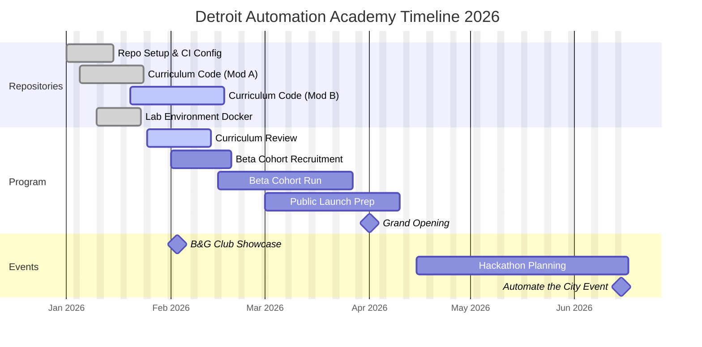

# Project Plan: Detroit Automation Academy

**Date:** January 6, 2026
**Status:** Active / Phase 1
**Repository Context:** `github.com/smit4786/detroit-automation-academy`

## 1. Executive Summary
The Detroit Automation Academy aims to upskill the local workforce in industrial and software automation. This project focuses on delivering a hybrid curriculum combining physical hardware automation (PLC/Robotics) with software automation (Python/CI/CD), leveraging open-source tools and local industry partnerships.

## 2. Scope of Work

### In-Scope
*   **Curriculum Development:**
    *   Module A: Python for Scripting & Data Entry.
    *   Module B: CI/CD Pipelines (GitHub Actions, Jenkins).
    *   Module C: IoT & Physical Automation (Raspberry Pi/Arduino integration).
*   **Infrastructure:**
    *   Setup of the "Virtual Lab" (Dockerized environments).
    *   Deployment of the Student Portal (LMS).
*   **Open Source Contributions:**
    *   Maintenance of public repositories for student use.

### Out-of-Scope
*   Advanced Machine Learning/AI (Reserved for Phase 2).
*   General Web Development (HTML/CSS) - Prerequisites expected.
*   Physical facility construction (utilizing existing partner spaces).

## 3. Completed GitHub Repository Work
The project is hosted in a monorepo structure. The following modules have been initialized:

### `curriculum` (Status: v1.0 Released)
*   [x] **Python Basics:** Complete set of Jupyter notebooks for weeks 1-4.
*   [x] **Automation Scripts:** Library of sample scripts for file manipulation, API interaction, and web scraping.
*   [x] **Unit Tests:** `pytest` coverage for all solution code.

### `lab-environment` (Status: Beta)
*   [x] **Docker Compose:** Standardized container setup for Python, Postgres, and Jenkins.
*   [x] **Vagrantfile:** VM configuration for students with legacy hardware.
*   [x] **Setup Scripts:** Bash/PowerShell scripts for one-click environment provisioning.

### `discord-bot` (Status: Live)
*   [x] **Discord Integration:** Bot handles student registration and role assignment.
*   [x] **FAQ Module:** Auto-responses for common troubleshooting issues.

### `student-portal` (Status: Planning)
*   [ ] **Web Dashboard:** Student interface for curriculum access.
*   [ ] **Auth Service:** Integration with GitHub OAuth.

## 4. Milestones & Timeline

| ID | Milestone | Description | Status | Target Date |
|:---|:---|:---|:---|:---|
| **M1** | **Repo Initialization** | Structure setup for all core repos. | **Completed** | Jan 01, 2026 |
| **M2** | **Curriculum Alpha** | Internal review of Modules A & B. | **Completed** | Jan 15, 2026 |
| **M2a**| **B&G Club Showcase** | Student activations at Grand Opening. | **Action Req**| Feb 03, 2026 |
| **M3** | **Beta Cohort Launch** | Small group (10 students) testing the lab. | On Track | Feb 15, 2026 |
| **M4** | **LMS Integration** | Connecting GitHub Auth to Learning Platform. | Pending | Mar 01, 2026 |
| **M5** | **Public Launch** | Enrollment open for Detroit residents. | Pending | Apr 01, 2026 |
| **M6** | **Hackathon** | "Automate the City" community event. | Planned | Jun 15, 2026 |

## 5. Milestone Chart (Gantt)

## 6. Resource Needs
*   **Cloud Credits:** AWS/Azure credits for CI/CD runners (Currently using GitHub Free Tier).
*   **Hardware:** 20x Raspberry Pi kits for Module C.
*   **Mentors:** 3x Senior DevOps Engineers for code reviews.

## 7. Risks
*   **Environment Consistency:** Students on Windows vs Mac may face Docker volume issues. *Mitigation: Prioritize Codespaces.*
*   **Curriculum Difficulty:** Module B (CI/CD) may be too steep for beginners. *Mitigation: Add pre-work workshops.*

## 8. Upcoming Events

### Boys & Girls Club Grand Opening (Feb 3-4, 2026)
*   **Goal:** Student programming showcase / hands-on activations.
*   **RSVP Deadline:** Friday, Jan 23rd (Contact Alise).
*   **Schedule:**
    *   **Feb 3 (Mon):** 4:00-5:00 PM, 6:00-7:00 PM (60 min slots).
    *   **Feb 4 (Tue):** 9:00 AM, 11:00 AM, 4:30 PM (90 min slots).
    *   **Audience:** ~100 guests.
    *   **Event Guide:** See [bgc_event_guide.md](bgc_event_guide.md) (three formats available).
